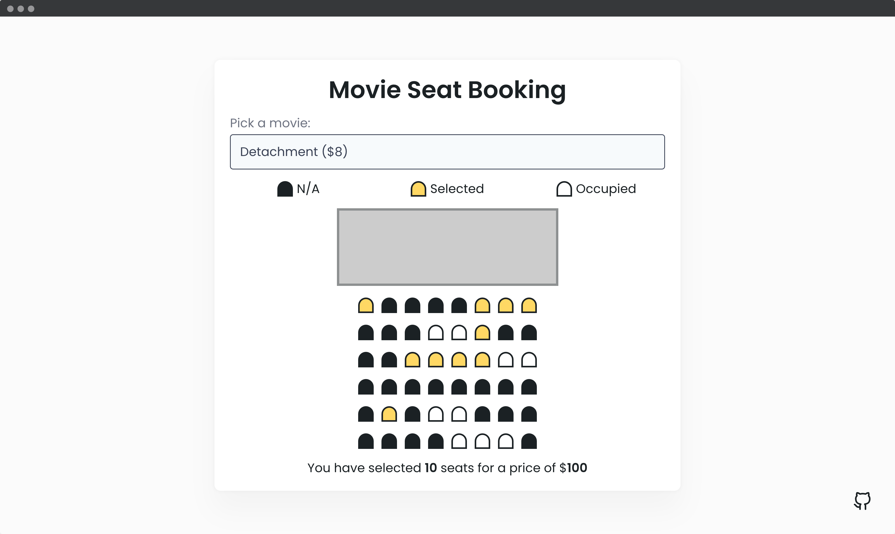

## 📦 Movie Seat Booking App

Display movie choices and seats in a theater to select from in order to purchase tickets.
- Display UI with movie select, screen, seats, legend & seat info
- User can select a movie/price
- User can select/deselect seats
- User can not select occupied seats
- Number of seats and price will update
- Save seats, movie and price to local storage so that UI is still populated on refresh

---
#### 🌄 Screenshots:

-----

#### 💻 Stack:

- [JavaScript](https://learn.javascript.ru/)
- [Sass](https://sass-lang.com/)

-----
#### 🙌 Author: [@nagoev-alim](https://github.com/nagoev-alim)
